<div align="center">

# ⚡ ZEUS

**A calm, personal record-keeper for training and eating.**

Android-only Flutter app for a small private group who train and eat with intention — structured split-day workouts, a check-in streak with monthly "freezes", and calorie / macro logging. No coaching, no gamification, no hype. Just an honest daily log that stays out of your way.

[](https://flutter.dev)
[](https://dart.dev)
[](https://firebase.google.com)
[](https://riverpod.dev)
[](#testing)
[](#)

</div>

---

## Table of contents

- [What it is](#what-it-is)
- [Screenshots](#screenshots)
- [Feature tour](#feature-tour)
- [Tech stack](#tech-stack)
- [Architecture](#architecture)
- [Data model](#data-model)
- [How the hard parts work](#how-the-hard-parts-work)
- [Project structure](#project-structure)
- [Getting started](#getting-started)
- [Testing](#testing)
- [Design system](#design-system)
- [Roadmap](#roadmap)
- [License](#license)

---

## What it is

ZEUS is a gym + nutrition companion app built for its creator plus a handful of friends and family. It is opened **in the middle of a workout or right after a meal** — never for a "session" — so every screen is built around one narrow job: log a check-in, complete today's split, or log a meal, then get out of the way.

It is delivered as a **shareable APK** (`flutter build apk`), not through the Play Store, and is developed in four phases:

| Phase | Scope | Status |
|------:|-------|--------|
| 1 | Foundation · auth · split/workout tracking · check-in streak with freezes | ✅ Shipped |
| 2 | Calorie & macro tracking (TDEE goal, Open Food Facts search, manual entry) | ✅ Shipped |
| 3 | Reminders (Firebase Cloud Messaging) | 🔜 Planned |
| 4 | Social — friends, shared streaks, chat | 🔜 Planned |

Phase 2 is deliberately **independent** of Phase 1: logging food never touches your streak, and the streak algorithm never looks at food.

---

## Screenshots

> Captured from a debug build running on an Android 14 emulator (Pixel 7). They also show the current **visual split**: Auth / Onboarding / Home / Split screens use a dark "Apple Fitness" look, while Calendar / Calorie Log / Add Food / Calorie Goal / Profile still use the original forest-green Material system (see [Design system](#design-system)).

| Sign up | Onboarding — first split day | Home / Summary |
|---|---|---|
| 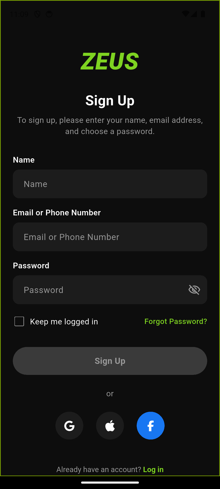 | 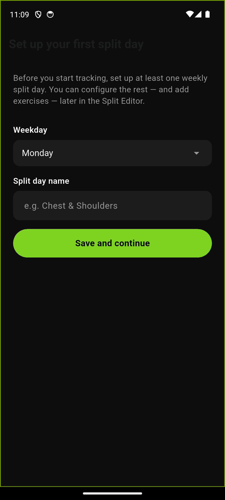 | 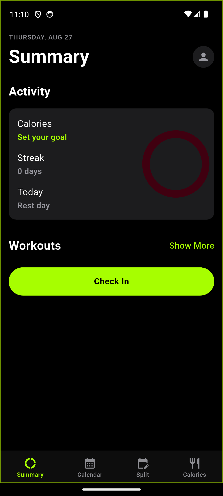 |

| Split editor (weekly) | Split day detail | Calendar (check-in states) |
|---|---|---|
| 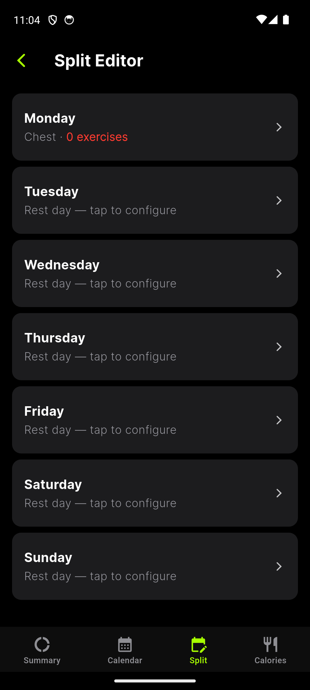 | 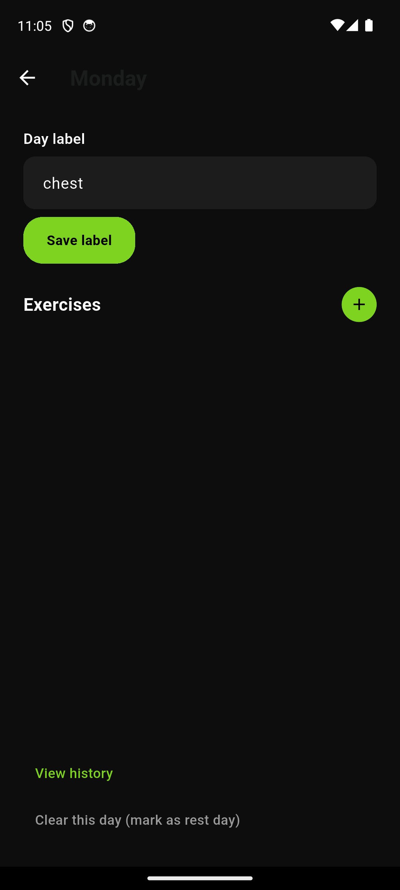 | 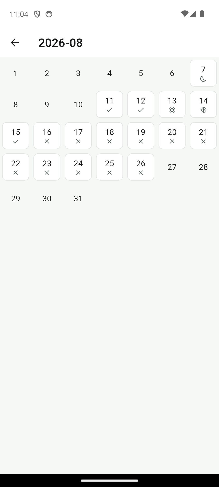 |

| Calorie log | Add food — manual | Add food — Open Food Facts search |
|---|---|---|
| 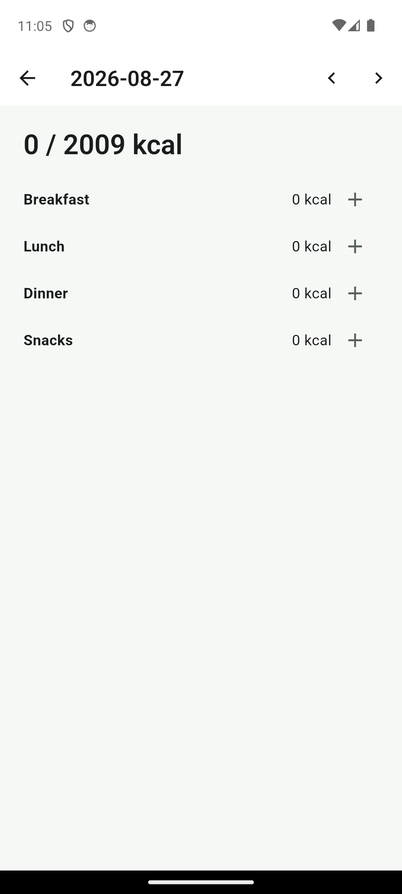 | 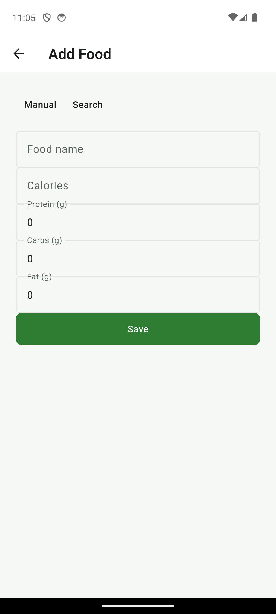 | 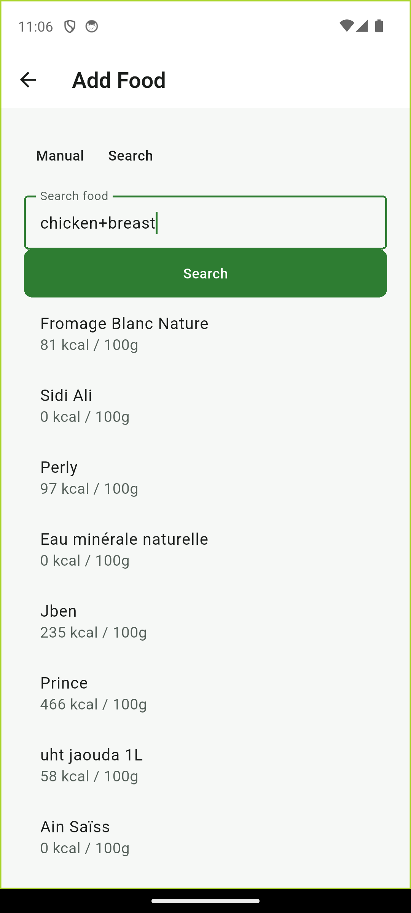 |

| Calorie goal (TDEE calculator) | Profile |
|---|---|
| 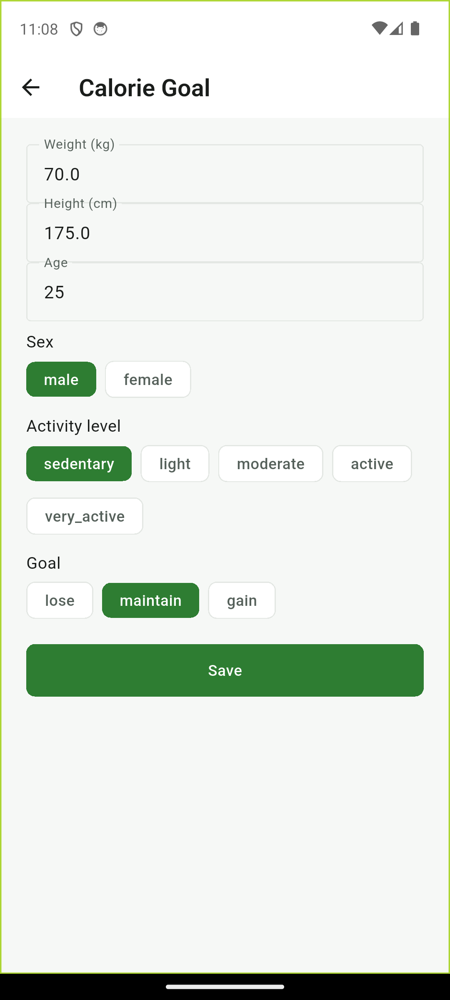 | 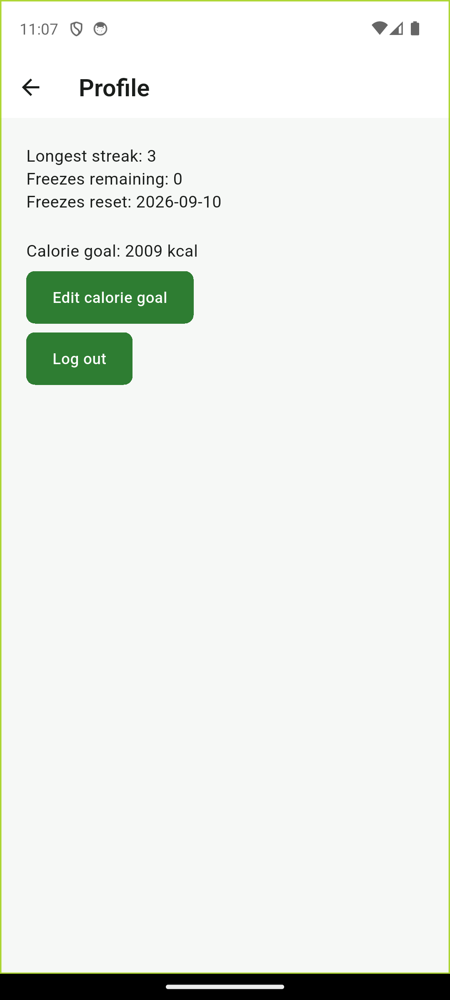 |

<sub>The Calendar legend: ✓ checked in · ❄ freeze used · ☾ rest day · ✕ missed. Per-split-day **volume history** (an `fl_chart` line chart) appears on the Split History screen once that day has completed sessions.</sub>

---

## Feature tour

### Training

- **Weekly split editor** — one configurable workout per weekday (Mon–Sun). Each day has a label ("Chest & Shoulders") and an ordered list of exercise targets (`name`, `targetSets`, `targetReps`, `targetWeight`). Unconfigured days render as rest days.
- **Check-in streak** — one tap on Home writes today's check-in and grants streak credit *immediately*, decoupled from whether you log any exercises afterward.
- **Workout logging** — after checking in, the day's split appears as a checklist. A `workoutLogs` **draft** is created the moment you tick your first exercise; every later edit (sets, reps, weight, notes) autosaves to that draft, so backing out mid-session loses nothing. **Finish** flips the draft to `completed` and records untouched exercises as `skipped`.
- **Streak freezes** — you get **2 freezes per month** (auto-reset). A missed day silently spends a freeze instead of breaking the streak; once freezes run out, the streak resets to 0. All computed on app open (see [gap-walk](#2-the-streak-gap-walk-freezes)).
- **Rest days** — pre-mark a day as a rest day from the calendar; the gap-walk then skips it without spending a freeze.
- **Split history** — per split day, an `fl_chart` line chart of total training **volume** (`sets × reps × weight`) across every completed session, newest-first log list below.

### Nutrition

- **TDEE calorie goal** — a Mifflin–St Jeor calculator (weight, height, age, sex, activity level, goal direction) produces a daily `calorieGoal` and a 30 / 40 / 30 protein / carb / fat macro split. Inputs are saved and re-editable.
- **Food logging** — per day, entries grouped into Breakfast / Lunch / Dinner / Snacks with per-meal subtotals and a running total against your goal ("1,450 / 2,200 kcal").
- **Two entry paths, one save** —
  - **Search**: debounced [Open Food Facts](https://world.openfoodfacts.org) query (no API key); pick a result, enter grams, per-100 g figures are scaled to entry totals.
  - **Manual**: type the name and totals directly — no quantity step — for home-cooked food Open Food Facts doesn't have.
- **Recently logged quick-add** — computed client-side from your own last 7 days of entries; no separate food-catalog collection.
- **Snapshotted entries** — full nutrition is embedded in each entry at save time, so editing a food later never rewrites history.

### Cross-cutting

- **Offline-first** — Firestore's local cache means check-ins, workout logs and manual food entries all work at the gym with no signal; writes sync when connectivity returns. A banner shows offline state (`connectivity_plus`).
- **Auth-gated navigation** — `go_router` redirects enforce `signed out → /auth`, `signed in but new → /onboarding`, `onboarded → /home`, reacting live to `FirebaseAuth` state changes.

---

## Tech stack

| Layer | Choice | Notes |
|---|---|---|
| Language / SDK | **Dart 3.12**, **Flutter 3.12+** | `environment: sdk: ^3.12.2` |
| UI | **Material 3** (`useMaterial3: true`) | Light + dark `ColorScheme`, `ThemeMode.system` |
| State management | **Riverpod** (`flutter_riverpod` ^3.4.2) | `ProviderScope` at root; screens also use constructor injection of repositories via the router |
| Routing | **go_router** ^17.3.0 | Declarative routes + async redirect guard + `refreshListenable` on the auth stream |
| Auth | **Firebase Auth** ^6.5 | Email / password |
| Database | **Cloud Firestore** ^6.7 | Offline persistence, per-user document tree, security rules + composite indexes in repo |
| Networking | **http** ^1.6 | Open Food Facts `/api/v2/search` |
| Charts | **fl_chart** ^1.1 | Split-day volume progression |
| Connectivity | **connectivity_plus** ^7.3 | Offline banner |
| Fonts / icons | **google_fonts** (Inter), `cupertino_icons`, `font_awesome_flutter` | |
| Formatting | **intl** ^0.20 | Dates / numbers |
| Testing | `flutter_test`, **mocktail**, **fake_cloud_firestore**, **firebase_auth_mocks** | 134 tests |
| Rules tests | Node + `@firebase/rules-unit-testing` (Jest) | `firestore-tests/` |

---

## Architecture

ZEUS is a **layered single-module Flutter app**. Widgets never touch Firestore directly — every read/write goes through a repository, and every non-trivial rule (streak math, TDEE math, nutrition scaling) is extracted into a **pure function** that is unit-tested without Firebase.

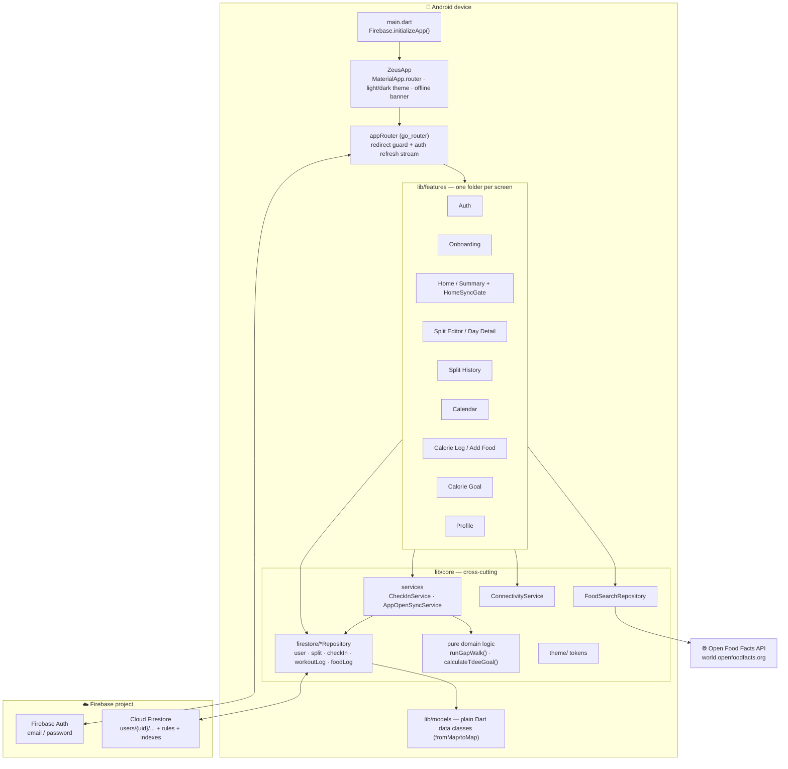

### Auth & onboarding redirect flow

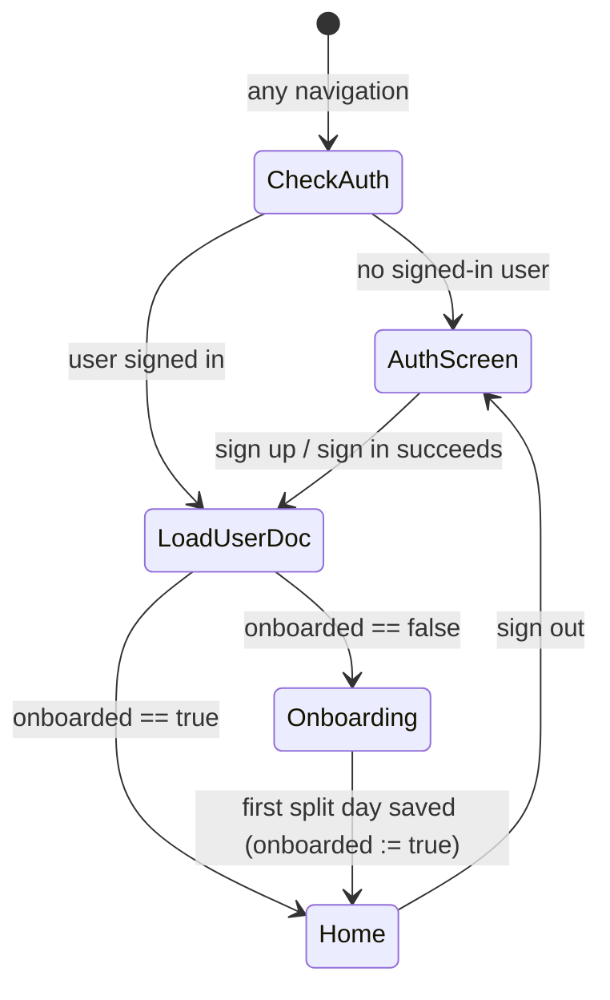

### App-open sync (streak) sequence

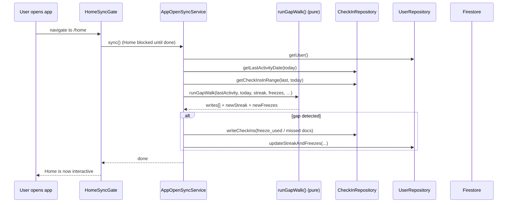

---

## Data model

All data lives under a single per-user document tree in Firestore. Date-keyed documents (`YYYY-MM-DD` as the **document ID**) are the idempotency mechanism — the same day can only ever have one check-in / food-log doc.

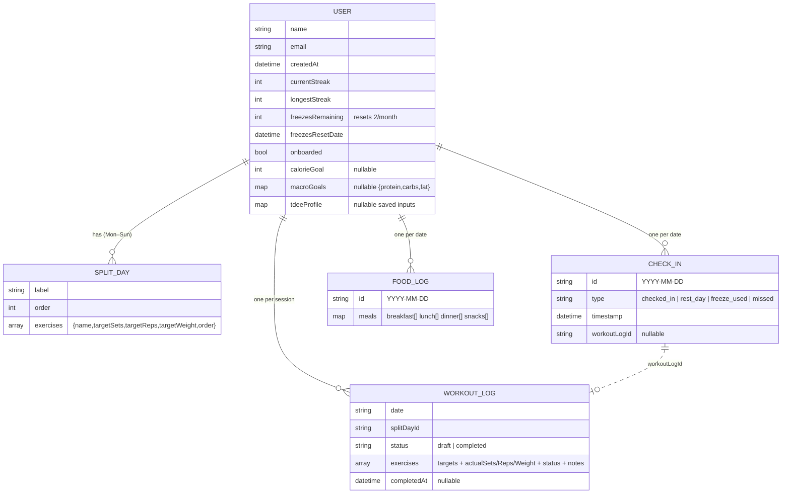

**Food entry** (embedded in `foodLogs/{date}.meals.*`):

```jsonc
{
  "name": "Greek yogurt",
  "calories": 130,          // total for the entry, already scaled — never per-100g
  "protein": 11, "carbs": 8, "fat": 4,
  "quantity": 150,          // grams — set for openfoodfacts entries, null for manual
  "unit": "g",              // null for manual
  "source": "openfoodfacts", // or "manual"
  "loggedAt": "2026-08-05T09:12:00Z"
}
```

Security rules (`firestore.rules`): every document under `users/{uid}` is readable/writable **only** by `request.auth.uid == uid`. Composite indexes (`firestore.indexes.json`) back the completed-workout-by-split-day query and the descending check-in lookup.

---

## How the hard parts work

### 1. Idempotent check-in

`checkIns/{date}` uses the **calendar date string as the document ID**, not an auto-ID. Tapping "Check In" runs a Firestore **transaction** that:

1. reads today's check-in doc — if it already exists as `checked_in`, returns (no double streak credit);
2. otherwise writes the `checked_in` doc **and** bumps `currentStreak` / `longestStreak` atomically.

`currentStreak` is a stored counter but is only ever mutated inside this transaction (or the gap-walk), never incremented by a raw button tap, so double-tapping is harmless.

### 2. The streak gap-walk (freezes)

`runGapWalk()` in `lib/core/streak/gap_walk.dart` is a **pure function** of
`(lastActivityDate, today, currentStreak, freezesRemaining, freezesResetDate, existingCheckIns) → (writes[], newStreak, newFreezesRemaining, newFreezesResetDate)`.

On every app open, `AppOpenSyncService.sync()` runs it and `HomeSyncGate` blocks the Home screen until it finishes, so a "Check In" tap can never race the sync:

1. **Monthly freeze reset first** — if `freezesResetDate` has passed, `freezesRemaining` is reset to 2 and the date advanced one month (with day-clamping so Jan 31 → Feb 28). Ordering matters: a stale low freeze count must not cause a wrongful `missed` day.
2. **Walk each date** from the day after `lastActivityDate` through yesterday, oldest first:
   - a doc already exists (e.g. a pre-marked rest day) → skip, touch nothing;
   - no doc, `freezesRemaining > 0` → write `freeze_used`, decrement;
   - no doc, no freezes → write `missed`, set streak `0`, keep walking (remaining `missed` days are cosmetic).
3. **Today stays open** — checking in today makes the streak `1` (if it just broke) or increments normally.

Because it is pure, the whole freeze/streak matrix is unit-tested with zero Firebase.

### 3. TDEE & macro goal

`calculateTdeeGoal()` in `lib/core/nutrition/tdee_calculator.dart`:

```
BMR   = 10·kg + 6.25·cm − 5·age + (male ? +5 : −161)          // Mifflin–St Jeor
TDEE  = BMR × activityMultiplier                              // 1.2 … 1.9
goal  = TDEE − 500 (lose) | TDEE (maintain) | TDEE + 300 (gain)
macros = 30% protein / 40% carbs / 30% fat  →  grams at 4/4/9 kcal·g⁻¹
```

No network, no API — fully offline and unit-tested per branch.

### 4. Open Food Facts search

`FoodSearchRepository` wraps the free `/api/v2/search` endpoint (descriptive `User-Agent` per their policy, 10 s timeout). Results missing a usable calorie/macro figure are dropped rather than shown broken. A picked result's per-100 g figures are scaled by the entered grams (`value × qty / 100`) into a `FoodEntry` with totals — the **same shape** manual entry produces, so both paths share one save.

---

## Project structure

```
lib/
├── main.dart                     # Firebase init + ZeusApp (MaterialApp.router)
├── core/
│   ├── auth/                      # AuthRepository, Riverpod providers
│   ├── checkin/                   # CheckInService (transactional check-in)
│   ├── connectivity/             # ConnectivityService + offline banner
│   ├── firebase/                  # generated firebase_options.dart
│   ├── firestore/                 # *Repository — user, split, checkIn, workoutLog, foodLog
│   ├── nutrition/                 # tdee_calculator.dart, food_search_repository.dart
│   ├── router/                    # app_router.dart, go_router_refresh_stream.dart
│   ├── streak/                    # gap_walk.dart  (pure streak algorithm)
│   ├── sync/                      # app_open_sync_service.dart
│   ├── theme/                     # ColorScheme + spacing + typography tokens, mockup palettes
│   └── widgets/                   # AppleBottomBar (shared frosted tab bar)
├── features/                      # auth · onboarding · home · calendar · calories · split_editor · split_history · profile
└── models/                        # AppUser, SplitDay, CheckIn, WorkoutLog, FoodLog, FoodEntry, MacroGoals, TdeeProfile, …

test/                             # 134 tests mirroring lib/  (fake_cloud_firestore + firebase_auth_mocks)
firestore-tests/                  # Node/Jest security-rules suite
android/                          # Gradle Kotlin DSL, google-services.json
docs/superpowers/                 # phase specs + implementation plans
firestore.rules · firestore.indexes.json · firebase.json
DESIGN.md · PRODUCT.md            # design system + product brief
```

---

## Getting started

### Prerequisites

- **Flutter SDK ≥ 3.12** (Dart 3.12) — `flutter doctor` should be clean for the Android toolchain
- **Android SDK** + an emulator or a physical device (`adb devices`)
- A **Firebase project** with **Email/Password** auth and **Cloud Firestore** enabled

### 1 · Clone & install

```bash
git clone https://github.com/shaktivijayas/ZEUS.git
cd ZEUS
flutter pub get
```

### 2 · Firebase configuration

The repo already contains a working config for the original project
(`android/app/google-services.json` and `lib/core/firebase/firebase_options.dart`).
To point a fork at **your own** Firebase project:

```bash
dart pub global activate flutterfire_cli
flutterfire configure          # regenerates firebase_options.dart + google-services.json
```

Then deploy the rules and indexes:

```bash
npm install -g firebase-tools
firebase deploy --only firestore:rules,firestore:indexes
```

### 3 · Run

```bash
flutter run                              # debug, on the connected device/emulator
flutter build apk --release              # shareable APK → build/app/outputs/flutter-apk/
```

On first launch: **Sign up** → create your **first split day** (this flips `onboarded`) → you land on Home. Set a calorie goal from **Profile → Set calorie goal** to activate the nutrition progress display.

---

## Testing

```bash
flutter test                             # 134 unit + widget tests

# Firestore security-rules suite (needs the Firebase emulator)
cd firestore-tests
npm install
firebase emulators:exec --only firestore "npm test"
```

Test strategy:

- **Pure functions** (`runGapWalk`, `calculateTdeeGoal`, nutrition scaling) — exhaustive branch coverage, no Firebase.
- **Repositories** — run against `fake_cloud_firestore`.
- **Auth** — `firebase_auth_mocks`.
- **Widgets** — every screen has a test asserting its core behaviour (meal grouping & subtotals, validation errors are *visible* not silent, chips resolve colours from `ColorScheme`, rest-day rendering, etc.).
- **Rules** — `@firebase/rules-unit-testing` verifies cross-user reads/writes are denied.

---

## Design system

`DESIGN.md` defines **"The Lab Notebook"**: one forest-green accent used on ≤10 % of any screen, flat tonal surfaces (no resting shadows), a single typeface (Roboto) carrying hierarchy through weight/size alone, tabular figures for numbers, and a deliberately re-toned **dark `ColorScheme`** (not an alpha-invert). Accessibility baseline is WCAG AA contrast + respect for the system font-scale.

> **Note on visual drift:** the shipped app currently mixes two looks. The original Material-3 "Lab Notebook" light system still governs Calendar, Calorie Log, Add Food, Calorie Goal and Profile, while Auth, Onboarding, Home, Split Editor and Split History were later restyled against dark "Apple Fitness" mockups with their own fixed palettes (`ApplePalette`, `DarkMockupPalette`) and the Inter typeface. `PRODUCT.md` documents this split as known technical debt.

---

## Roadmap

- **Phase 3 — Reminders**: Firebase Cloud Messaging nudges for check-ins and meals.
- **Phase 4 — Social**: friends, shared streaks, lightweight chat.
- Unify the design system back to one coherent look (resolve the Material-light / Apple-dark split).
- Better nutrition coverage for home-cooked / regional dishes (dedicated dataset or commercial API).
- User-tunable macro split.

---

## License

No license file is currently included in this repository — all rights reserved by the author. Add a `LICENSE` file to make reuse terms explicit.
